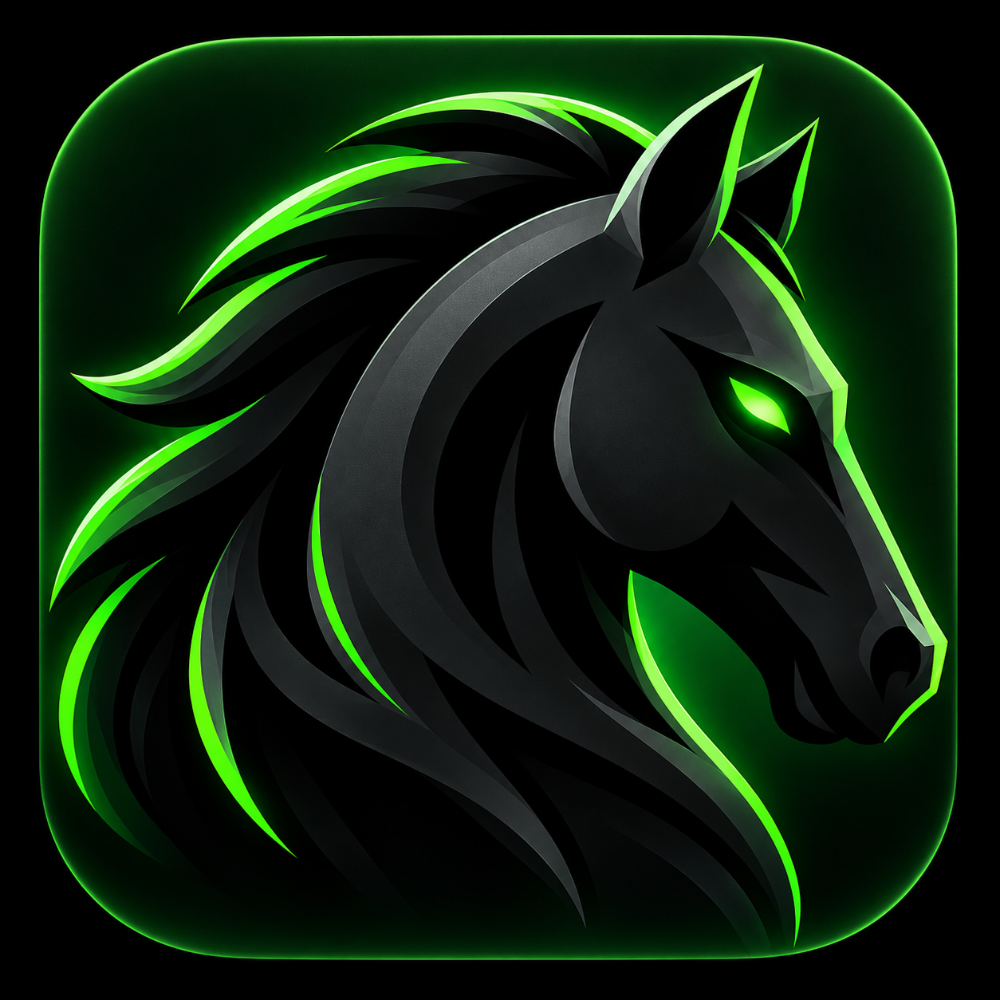

<p align="center">
  
</p>

<h1 align="center">DarkHorseCode</h1>

<p align="center">
  Describe an app in plain English. AI agents build it while you watch.<br>
  Desktop app for Windows and Linux, built on the <a href="https://opencode.ai">opencode</a> engine.
</p>

<p align="center">
  <a href="https://github.com/nihalrasekar/darkhorsecode/releases/latest/download/DarkHorseCode.exe"><b>⬇ Download for Windows</b></a>
  &nbsp;·&nbsp;
  <a href="https://github.com/nihalrasekar/darkhorsecode/releases/latest/download/DarkHorseCode.AppImage"><b>⬇ Download for Linux</b></a>
  &nbsp;·&nbsp;
  <a href="https://github.com/nihalrasekar/darkhorsecode/releases">All versions</a>
</p>

---

## Download and run

No coding needed. Pick your system:

### Windows (10 / 11)

1. Download **[DarkHorseCode.exe](https://github.com/nihalrasekar/darkhorsecode/releases/latest/download/DarkHorseCode.exe)**.
2. Double-click it and follow the installer.
3. If Windows shows "Windows protected your PC", click **More info → Run anyway**. The app is not code-signed yet.
4. Open **DarkHorseCode** from the Start menu.

### Linux (x64)

1. Download **[DarkHorseCode.AppImage](https://github.com/nihalrasekar/darkhorsecode/releases/latest/download/DarkHorseCode.AppImage)**.
2. Make it runnable, then start it:
   ```bash
   chmod +x DarkHorseCode.AppImage
   ./DarkHorseCode.AppImage
   ```
   Or right-click the file → **Properties → Permissions → Allow executing as program**, then double-click it.
3. If it fails to start with a FUSE error, install it: `sudo apt install libfuse2` (Ubuntu/Debian).

## First steps

1. **Pick a model.** Open **Settings → Model** and choose a provider (see below).
2. **Describe your app.** On **New App**, type your idea and choose a build type: Full-stack, Mobile, Landing page or Website.
3. **Watch it build.** You land in the **Builder**. Each read, edit and command shows as a card, and the live preview updates as the app changes. Send follow-ups in the chat.

> **Fastest free start:** Settings → **OpenCode** → click **Big Pickle**, then paste a free key from [opencode.ai/auth](https://opencode.ai/auth). No card needed.

### Model providers

| Provider | How to connect | Cost |
|---|---|---|
| **OpenCode** (Zen) | Free API key from opencode.ai/auth | Free models available |
| **Anthropic** (Claude) | API key from [console.anthropic.com](https://console.anthropic.com) | Pay per use |
| **ChatGPT** (Codex) | Sign in with your ChatGPT account | Uses your ChatGPT plan |
| **Ollama** | Install [Ollama](https://ollama.com), then `ollama pull qwen2.5-coder:7b` | Free, runs locally |

### What's inside

- **New App**: start a project from a prompt.
- **Builder**: chat with the agent, see tool calls and a live preview.
- **Architecture**: talk through design with a read-only agent, then hand the plan to Build.
- **Projects / Sessions**: reopen past apps and conversations.
- **Deploy**: ship through a connected service such as Vercel.
- **Agent Studio**: the Build, Architect and Plan agents, plus your own custom agents.
- **MCP Connectors**: give agents extra tools (Supabase, Vercel, Playwright, …).
- **Usage**: tokens and cost per day.

Press `Ctrl K` to jump to any tab, and `?` to see all shortcuts.

## Run from source

For developers who want to change the app. You need [Node.js 22](https://nodejs.org) and Git.

```bash
git clone https://github.com/nihalrasekar/darkhorsecode.git
cd darkhorsecode
npm ci
npm run dev
```

Other commands:

| Command | What it does |
|---|---|
| `npm run dev` | Start the app with hot reload |
| `npm test` | Run the tests |
| `npm run dist` | Build the Windows installer into `release/` |
| `npm run dist:linux` | Build the Linux AppImage into `release/` |


## Sign-in and your data

DarkHorseCode doesn't implement OAuth itself. ChatGPT (Plus / Pro) sign-in runs opencode's own
login (`opencode providers login -p openai`). opencode's data dir (`XDG_DATA_HOME`) is pointed at the app's
own `%APPDATA%\darkhorsecode`, so the token lives in `%APPDATA%\darkhorsecode\opencode\auth.json`, not the shared
`~/.local/share/opencode`.

The Windows uninstaller deletes `%APPDATA%\darkhorsecode` (`nsis.deleteAppDataOnUninstall`), which removes the API key,
MCP tokens and ChatGPT sign-in. Updating over an existing install keeps them.

Claude has no sign-in: Anthropic rejects a Claude Pro/Max login token when a third-party app uses it
(`401 "API key is invalid"`), so Claude needs an API key from console.anthropic.com.

The code for this is in `src/main/agent/auth.js`.

## License

MIT © nihalrasekar
